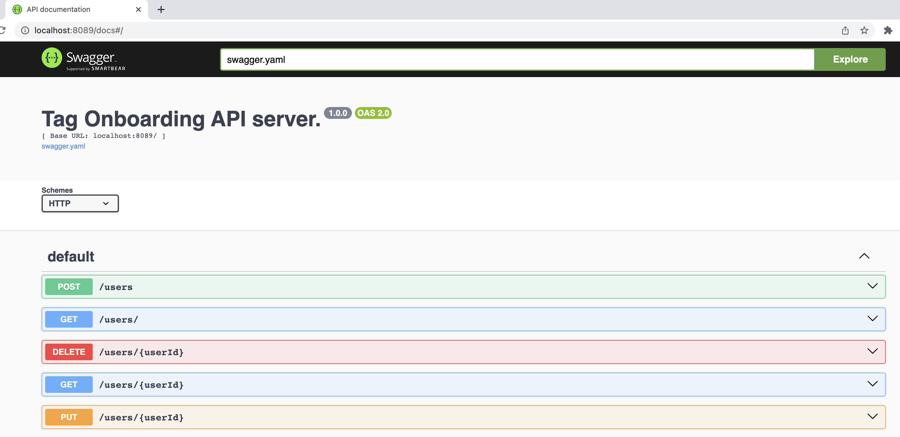

# PS Tag Onboarding Go

Tag Onboarding Project exercise using Go-Chi, Gorm, Go Validator, Sqlite in-memory


## Build

```
./build/compile.sh
```

This will generate `ps-tag-onboarding-go` executable.

## Run

```
./build/run.sh
```

This will start the `ps-tag-onboarding-go` server.

## Docker
You can also run this application from Docker. To do this, run the following command to build and run the application.

### Docker Build

At the root folder of the project run the docker command below to build a docker image of the Tag Onboarding application:
```
docker build -t wexinc/ps-tag-onboarding-go .
```
Make sure to have a docker runtime installed locally.

### Docker Compose
After having built the docker image, use the command below to start the application:
```
docker-compose up -d
```

## API Endpoints

All CRUD operations have been implemented and can be accessed via the base url path `http://localhost:8089/users/`.

### Curl Commands

To access the REST endpoints you could use the following curl commands:

#### Get All Users

```
curl -X GET http://localhost:8089/users/ 
```
#### Get User By Id

```
curl -X GET http://localhost:8089/users/1
```

#### Create A User

```
curl -X POST http://localhost:8089/users -H 'Content-Type: application/json' -d '{"first_name":"Thomas","last_name":"Jefferson","email":"t.jefferson@yahoo.com","age":38}'
```

#### Update A User

```
curl -X PUT http://localhost:8089/users/6 -H 'Content-Type: application/json' -d '{"id":6,"first_name":"Ben","last_name":"Jefferson","email":"t.jefferson@yahoo.com","age":39}'
```

#### Delete A User

```
curl -X DELETE http://localhost:8089/users/6
```

### Swagger UI
Alternatively you could interact with the application via Swagger UI from the url `http://localhost:8089/docs/`



## Design Decisions
Here is the list of external libraries and the reason why they have been imported: 

### Go-Chi 
Lightweight, idiomatic and composable router for building Go HTTP services

### Gorm
ORM for Go, it helps separate out DB specifics and business logic
Robust abstraction layer between the Go code and the database,

### Sqlite In memory 
Easy, fast and handy to use for small and prototype projects

### Go Validator
Go Validator implements value validations for structs and individual fields based on tags. It supports both built-in validators and custom validators
